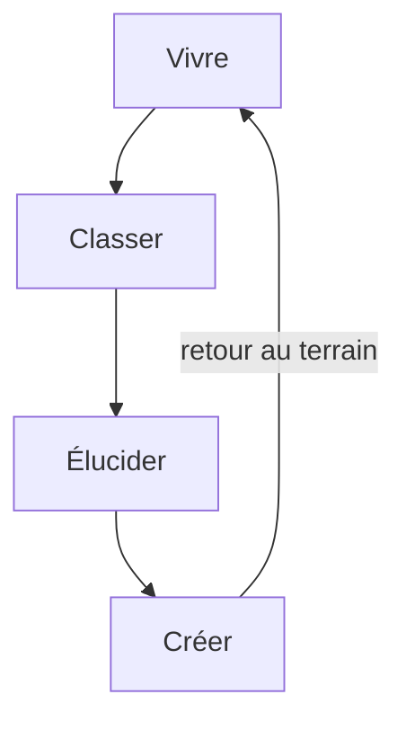

Page de référence pour tous les objets disponibles dans cet espace Quartz.
Utile pour tester le rendu avant de les utiliser dans des notes réelles.

---

## Typographie

# Titre H1
## Titre H2
### Titre H3
#### Titre H4

Texte courant avec **gras**, *italique*, ~~barré~~, et `code inline`.

Texte avec ==surlignage== (syntaxe Obsidian).

> Citation simple — une pensée suspendue, en lisière d'une autre.

> [!quote] Citation nommée
> "Mon corps décline mais ma pensée croît. Dans ma vieillesse il y a une éclosion."
> — Victor Hugo

---

## Liens

[[Lien interne]] · [[Lien interne|avec alias]] · [Lien externe](https://cooplab.org)

---

## Listes

- Élément A
- Élément B
  - Sous-élément B1
  - Sous-élément B2
- Élément C

1. Premier
2. Deuxième
3. Troisième

- [ ] Tâche à faire
- [x] Tâche faite

---

## Tableau

| Champ | Valeur | Statut |
|---|---|---|
| type | note_pivot | ✓ |
| grappe | robustesse_et_soin | ✓ |
| niveau_dikw | knowledge | en cours |
| espace | public | ✓ |

---

## Callouts natifs Quartz

> [!note] Note
> Information neutre, contexte ou rappel.

> [!tip] Conseil
> Une piste à explorer, une astuce pratique.

> [!warning] Attention
> Point de vigilance, limite, mise en garde.

> [!danger] Danger
> Erreur critique, point bloquant.

> [!info] Info
> Complément d'information non essentiel.

> [!question] Question ouverte
> Ce qui reste à élucider, l'enquête en cours.

> [!success] Réussite
> Ce qui a fonctionné, une étape franchie.

> [!abstract] Résumé
> Synthèse condensée d'un développement plus long.

> [!example] Exemple
> Illustration concrète d'un concept.

> [!quote] Citation
> Extrait de source, parole d'auteur.

---

## Callout repliable

> [!note]- Cliquer pour déplier
> Ce contenu est masqué par défaut.
> Utile pour les développements optionnels, les notes de bas de page longues.

> [!warning]+ Ouvert par défaut, repliable
> Ce callout commence ouvert et peut être replié.

---

## Callout personnalisé CARe

> [!care] Communauté apprenante
> Spécifique à l'espace Utopia/CARe.
> Signale un contenu lié aux pratiques de soin, de robustesse, d'autoformation collective.

---

## Infobox (style Morrowind Wiki)

> [!infobox]
> # Oscar Jara Holliday
> **Nationalité** · Chili / Costa Rica
> **Domaine** · Éducation populaire, recherche-action
> **Concept clé** · Systématisation d'expérience
>
> | Étape | Description |
> |---|---|
> | Vivre | L'expérience vécue |
> | Classer | Ordonner les données |
> | Élucider | Dégager le sens |
> | Créer | Produire du savoir |

---

## Caption (légende sous image)

![[image-exemple.png]]

> [!caption] Figure 1
> Description de l'image : contexte, source, date.

---

## Colonnes (column callout)

> [!column]
>> [!info] Colonne gauche
>> Contenu à gauche — note, liste, fragment.
>
>> [!tip] Colonne droite
>> Contenu à droite — complément, contre-point.

---

## Code

```python
# Exemple Python
def jara(experience):
    vivre = observer(experience)
    classer = ordonner(vivre)
    elucider = analyser(classer)
    return creer(elucider)
```

```bash
# Commande Git Bash
git add -A && git commit -m "feat: nouvelle note" && git push
```

---

## Maths (LaTeX / KaTeX)

Formule en ligne : $E = mc^2$

Formule en bloc :

$$
\int_{-\infty}^{\infty} e^{-x^2} dx = \sqrt{\pi}
$$

---

## Diagramme Mermaid



---

## Transclusion

![[lettre-futur-moi#introduction]]

*(Transclusion d'une section d'une autre note — vivante : si la source évolue, le contexte hérite.)*

---

## Tags

#robustesse #soin #enquête #sciences-citoyennes #utopia

---

*Page de référence — ne pas publier telle quelle. Adapter au contenu réel avant de poser `publish: true`.*
